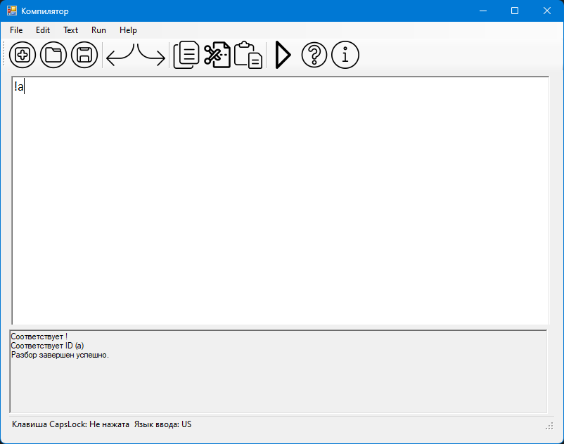
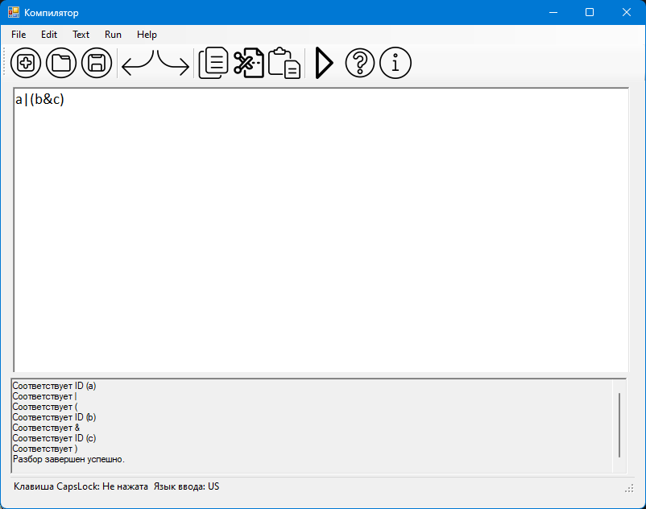
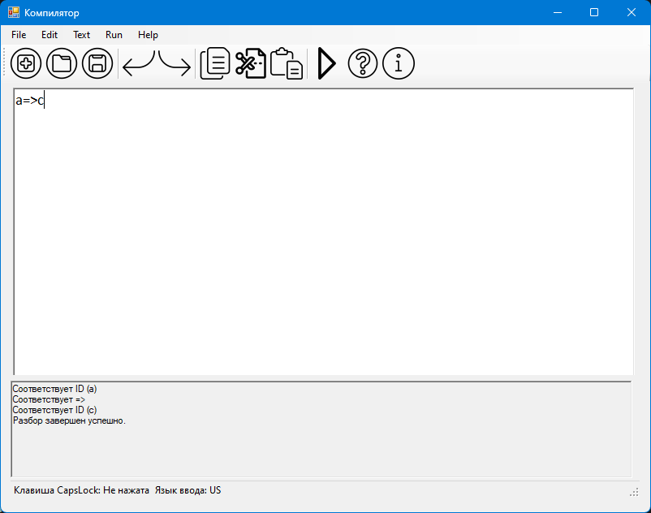

# Лабораторная работа 5

## Описание

Задача: Цель работы: Дополнить анализатор, разработанный в рамках лабораторных работ, этапом формирования внутренней формы представления программы.

## Персональный вариант №1

В качестве внутренней формы представления программы выберем польскую инверсную запись (ПОЛИЗ). Эта форма представления наглядна и достаточно проста для последующей интерпретации, которая может быть выполнена с использованием стека.

Задание:

1) Дополнить парсер грамматикой G[<АВ>]. Реализовать данную КС-граммматику методом рекурсивного спуска:

1. E → TA 

2. A → ε | + TA | - TA 

3. T → ОВ 

4. В → ε | *ОВ | /ОВ 

5. О → num | (E) 

2) Реализовать алгоритм записи арифметических выражений в ПОЛИЗ и алгоритм вычисления выражений в ПОЛИЗ.

## Примеры верных строк

((33-12)*(21+111))*2

12+72-11

## Тестовые примеры

